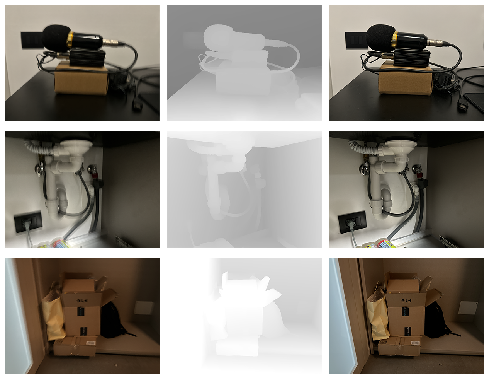

# LICAM Low-Light Image Dataset with Smarphone Lidar Depth Maps

This is the repository for the LICAM Low-Light Image Dataset. The Dataset is composed of photos acquired by an Apple iPhone 15 Pro and a Nikon Z30 DSLR camera. The photos have been taken under low light conditions so they are affected by motion blur and noise. Each photo has an associated depth map acquired by the iPhone Lidar sensor. Ground truth data not affected by motion blur are also available, acquired both by the iPhone and the DSLR camera.

The Dataset is organized as follows:

- **images** (1.6 GB): 400 images of resolution 1024x1024, each having:
    - blur : iPhone RGB image affected by motion blur and noise
    - depth : registered depth map acquired by the iPhone Lidar
    - sharp : registered ground truth image without motion blur acquired by iPhone
    - dslr : approximately registered image without motion blur acquired by DSLR
- **resized** (100 MB) : scenes cropped and resampled from the full resolution to 512x512
- **raw_scenes** (6 GB): the original data for the 100 high-resolution scenes after registration

The "images" data have been cropped from the full-resolution scenes as regions of interest, while the "resized" data have been resampled and center-cropped. The raw data (after registration) have also been included for completeness. The DSLR images are only approximately registered due to differences in focal length and they can be used for distribution-level quality metrics such as FID.

Each directory has predefined train/validation/test splits:
- 200 train images from 50 scenes
- 20 validation images from 5 scenes
- 180 test images from 45 scenes

## Data download
Links for data download are provided under each directory.

## Examples

## Acknowledgment

The LICAM -“AI-powered LIDAR fusion for next-generation smartphone cameras (LICAM)” project is funded by European Union – Next Generation EU within the PRIN 2022 program (D.D. 104 - 02/02/2022 Ministero dell’Università e della Ricerca). The contents of this website reflect only the authors' views and opinions and the Ministry cannot be considered responsible for them.
